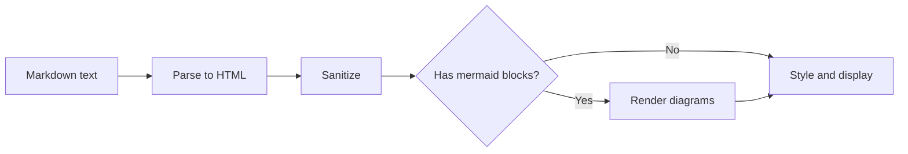
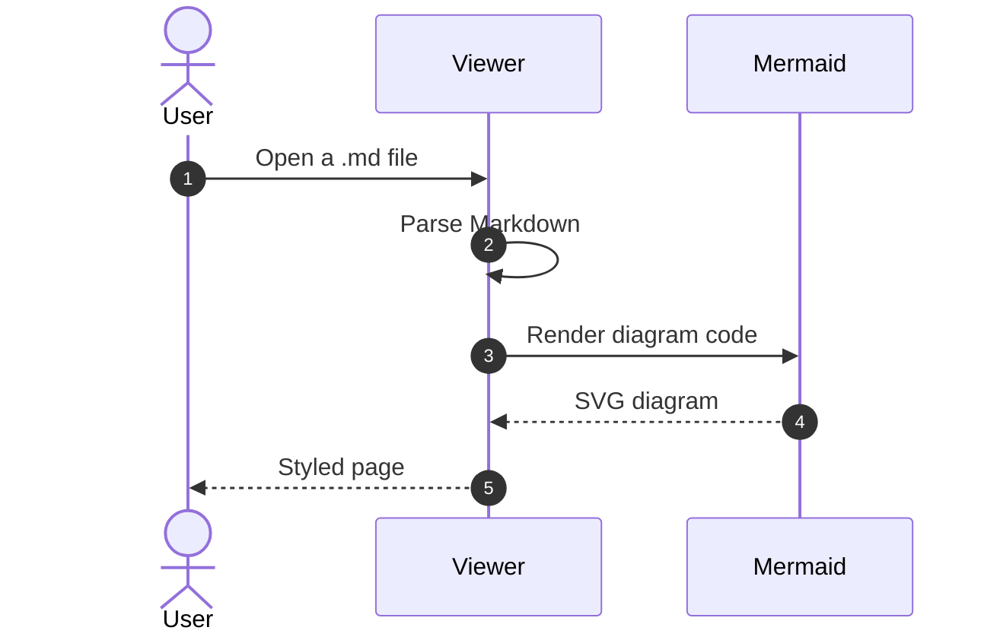
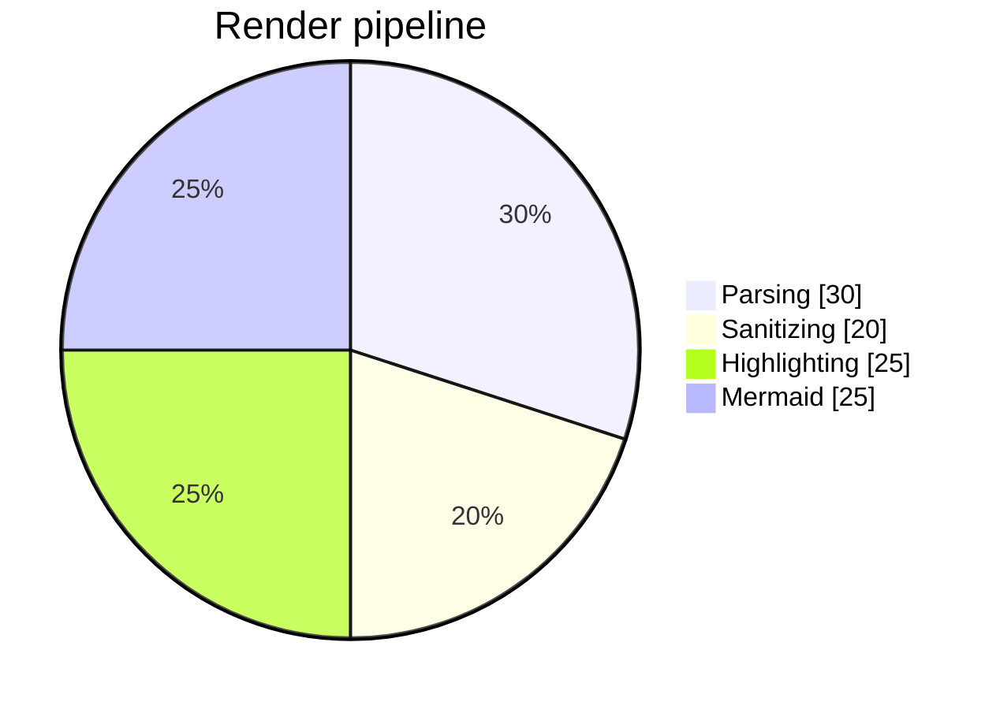

# Markdown Viewer — Feature Tour

This site is a **split-pane markdown editor & viewer**: write on one side,
read a live preview on the other. It runs entirely in your browser — no
server, no build step — and is designed to be hosted on GitHub Pages.

Everything you see here is rendered by the viewer itself. Open the editor
pane and try changing this text!

## Text formatting

Inline styles: **bold**, *italic*, ~~strikethrough~~, `inline code`, and
[links](https://github.com/amirkabiri/markdown-viewer). You can also combine **bold and _italic_**.

> Blockquotes look like this — with a soft accent bar on the start side,
> so they flip gracefully between LTR and RTL layouts.

## Code with syntax highlighting

```javascript
// highlight.js highlights this block — hover it for a copy button
export function greet(name = 'world') {
  const message = `Hello, ${name}!`;
  console.log(message);
  return message;
}
```

```python
def fibonacci(limit: int):
    a, b = 0, 1
    while a < limit:
        yield a
        a, b = b, a + b
```

## Tables

| Feature          | Supported | Notes                          |
| ---------------- | :-------: | ------------------------------ |
| GitHub Flavored Markdown | ✅ | tables, task lists, strikethrough |
| Mermaid diagrams | ✅        | flowcharts, sequences, pies…   |
| RTL / Persian    | ✅        | auto-detected per paragraph    |
| Dark mode        | ✅        | diagrams re-theme too          |

## Task lists

- [x] Split editor / preview layout
- [x] Persian UI + RTL content detection
- [x] Mermaid rendering
- [ ] Your next great document

## Mermaid diagrams

Flowcharts, sequence diagrams, pie charts and more — just write a fenced
code block tagged `mermaid`:







## Bilingual & RTL

Switch the UI language with the **فا / EN** button in the top bar. Content
direction is auto-detected per paragraph — see the
[Persian tour](?file=samples/sample-fa.md) for a full RTL demo. Links
ending in `.md` (like the one above) open right inside the viewer.
