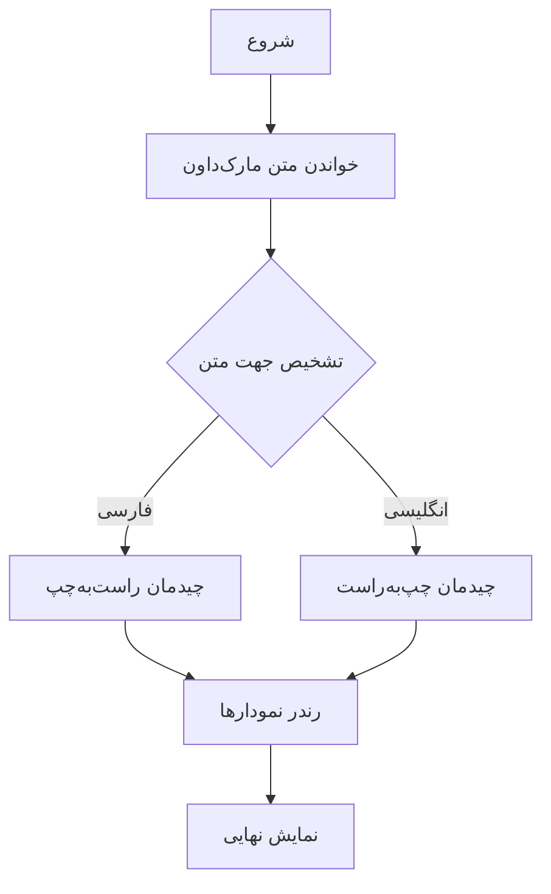
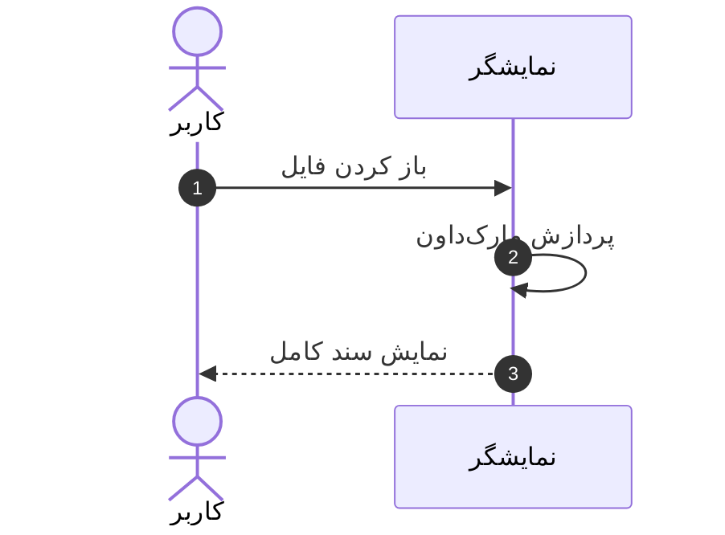

# نمایشگر مارک‌داون — دموی فارسی

این صفحه یک **نمایشگر و ویرایشگر مارک‌داون دو بخشی** است: سمت ویرایش متن
می‌نویسید و سمت پیش‌نمایش، خروجی به‌صورت زنده دیده می‌شود. همه‌چیز در مرورگر
شما اجرا می‌شود — بدون سرور و بدون نیاز به نصب — و برای میزبانی روی
GitHub Pages طراحی شده است.

## پشتیبانی از فارسی و راست‌به‌چپ

این نمایشگر از ابتدا برای فارسی طراحی شده است:

- **تشخیص خودکار جهت متن:** هر پاراگراف بر اساس نخستین نویسهٔ متنی، جهت
  خود را پیدا می‌کند؛ پس متن‌های دوزبانه هم درست نمایش داده می‌شوند.
- **فونت وزیرمتن:** متن فارسی با فونت [وزیرمتن](https://github.com/rastikerdar/vazirmatn)
  و فاصلهٔ خط مناسب فارسی نمایش داده می‌شود — مثلاً همین جمله!
- **چیدمان آینه‌ای:** دکمه‌ها، پنل‌ها و جدول‌ها با خصوصیات منطقی CSS
  نوشته شده‌اند و در حالت فارسی، چیدمان کل صفحه آینه می‌شود.
- میان‌بر صفحه‌کلید <kbd>Ctrl</kbd>+<kbd>O</kbd> پنجرهٔ باز کردن سند را نشان می‌دهد.

> متن‌های ترکیبی هم به‌هم نمی‌ریزند: کد و نشانی‌ها همیشه چپ‌به‌راست و
> بقیهٔ جمله راست‌به‌چپ می‌مانند. مثل `console.log("سلام")` در همین جمله.

## نمودارهای مرمید

نمودارها را داخل بلوک کد با زبان `mermaid` بنویسید — حتی با برچسب‌های فارسی:





## جدول‌ها

| قابلیت              | وضعیت | توضیح                        |
| ------------------- | :---: | ---------------------------- |
| زبان رابط فارسی     | ✅    | با یک کلیک از نوار بالا      |
| جهت خودکار محتوا    | ✅    | برای هر پاراگراف             |
| نمودار مرمید        | ✅    | با پوستهٔ روشن و تاریک       |
| هایلایت کد          | ✅    | صدها زبان برنامه‌نویسی       |
| حالت تاریک          | ✅    | با یادآوری انتخاب شما        |

## فهرست کارها

- [x] ویرایشگر دو بخشی با پیش‌نمایش زنده
- [x] رابط کاربری دوزبانه
- [x] تشخیص جهت راست‌به‌چپ
- [x] نمودارهای مرمید با برچسب فارسی
- [ ] سند بعدی شما!

## کد و هایلایت

```javascript
// حتی کامنت فارسی در کد هم درست نمایش داده می‌شود
const سلام = (نام = "دنیا") => `سلام، ${نام}!`;
console.log(سلام("گوست"));
```

---

از نمونهٔ [انگلیسی](?file=samples/sample-en.md) هم دیدن کنید، یا سند خودتان
را با کشیدن و رها کردن روی همین صفحه باز کنید.
